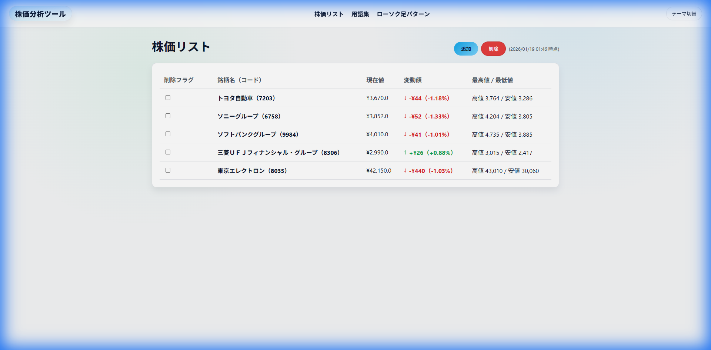
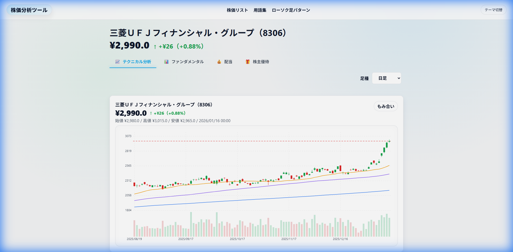
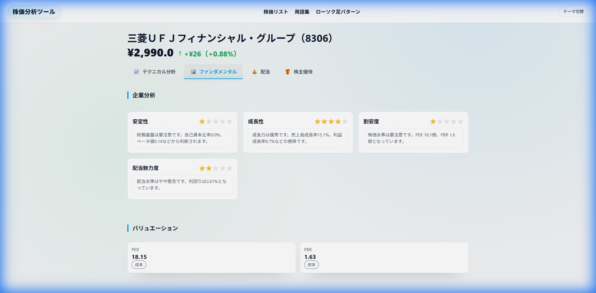
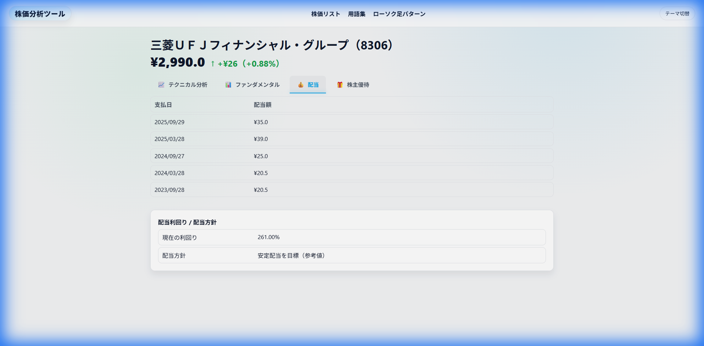
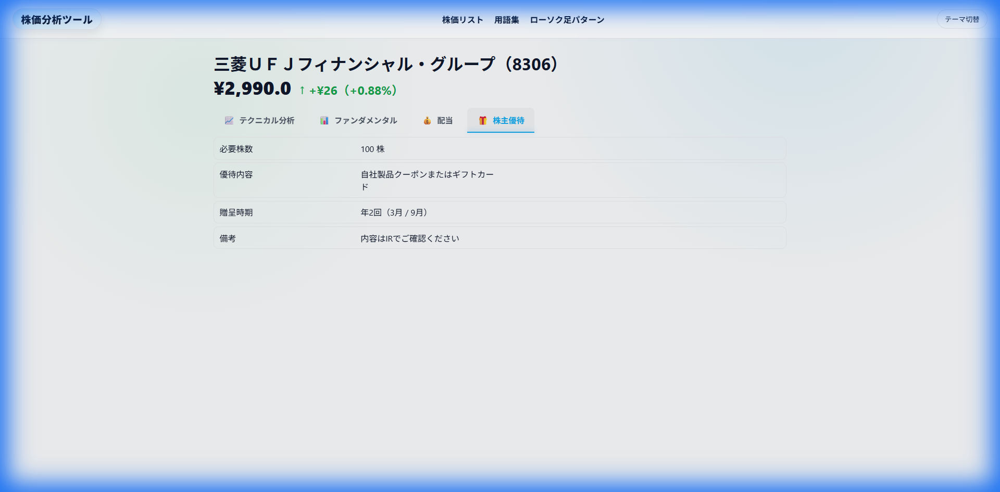

# 画面設計書

## 1. 銘柄リスト画面
**URL**: `/stocks`
**概要**: 登録済み銘柄の一覧を表示し、新規登録や削除を行う画面。

### 画面項目
| No | 項目名 | タイプ | 説明 | バリデーション/仕様 |
|---|---|---|---|---|
| 1 | 銘柄コード入力 | テキストボックス | 新規登録する銘柄コードを入力 | 数字4桁（一部英字含むETF等は要確認だが現状は4桁想定） |
| 2 | 追加ボタン | ボタン | 入力したコードの銘柄を追加する | 存在しない銘柄コードの場合はエラー表示 |
| 3 | 一括削除ボタン | ボタン | 選択した銘柄を一括削除する | 1つ以上選択されている場合のみ有効 |
| 4 | 全選択チェックボックス | チェックボックス | リスト内の全銘柄を選択/解除する | |
| 5 | 個別選択チェックボックス | チェックボックス | 対象行の銘柄を選択する | |
| 6 | 銘柄コード/名 | リンク | 詳細画面へ遷移する | |
| 7 | 現在値 | テキスト | 最新の株価を表示 | 小数第1位まで表示 |
| 8 | 変動幅 | バッジ | 前日比の変動額と変動率 | プラスは緑、マイナスは赤、0はグレー |

### 処理・ロジック
- **自動更新**: 画面リロードなしで定期的に株価情報を更新する（htmx polling）。
- **削除処理**: 削除ボタン押下時、確認ダイアログなしで即時削除し、リストから行を削除する（htmx delete）。

---

## 2. 銘柄詳細画面 - テクニカル分析（チャート）
**URL**: `/stocks/{code}` (Default tab)
**概要**: 銘柄の株価チャートとテクニカル指標、売買シグナルを表示する。

### 画面項目
| No | 項目名 | タイプ | 説明 | バリデーション/仕様 |
|---|---|---|---|---|
| 1 | ヘッダー：銘柄名 | テキスト | 銘柄名とコードを表示 | |
| 2 | ヘッダー：現在値・変動 | テキスト/バッジ | 現在値と前日比を表示 | 横並び・左寄せ。フォントサイズ1.5倍強調 |
| 3 | タブ | ボタン | 画面切り替え（テクニカル/ファンダメンタル/配当/優待） | 現在のタブを強調表示。切り替え時にローディング表示 |
| 4 | 足種選択 | ドロップダウン | チャートの足種を変更（日足/週足/月足など） | 変更時にチャートを再描画 |
| 5 | チャートエリア | Canvas | ローソク足、移動平均線、出来高を描画 | パン・ズーム操作が可能。マウスオーバーでツールチップ表示 |
| 6 | 売買シグナル | カード | テクニカル分析に基づくシグナル（買い/売り/中立） | 初心者向けにアイコンと色で表現 |

### 処理・ロジック
- **チャート描画**: Canvas APIを使用し、JavaScriptで描画。
- **軸ラベル**: 縦軸に「株価」、横軸に「日付」を表示。
- **視線誘導**: 重要な価格情報は左上に配置。

---

## 3. 銘柄詳細画面 - ファンダメンタル分析
**URL**: `/stocks/{code}/tab/fundamental`
**概要**: 企業の財務状況、バリュエーション、リスク情報を表示する。

### 画面項目
| No | 項目名 | タイプ | 説明 | バリデーション/仕様 |
|---|---|---|---|---|
| 1 | 企業分析スコア | カード | 成長性・安定性などの5段階評価 | ★アイコンで表示 |
| 2 | バリュエーション | カード | PER, PBR, 配当利回りなどの指標 | |
| 3 | 自己資本比率 | バッジ | 安全性を示す指標 | 40%以上=安定(緑)、20-40%=標準(灰)、20%以下=弱め(赤) |
| 4 | 財務諸表 | テーブル | 貸借対照表、損益計算書の要約 | EDINETデータを使用 |
| 5 | リスク/プラス情報 | カード | 投資判断におけるリスクとプラス材料 | 箇条書き。リスクは赤枠、プラスは緑枠 |

### 処理・ロジック
- **キャッシュ**: EDINETデータは `lru_cache` によりサーバーサイドでキャッシュされ、再表示を高速化。
- **エラーハンドリング**: データ取得失敗時はエラーメッセージを表示し、スコア等の計算可能な項目のみ表示する。

---

## 4. 銘柄詳細画面 - 配当情報
**URL**: `/stocks/{code}/tab/dividend`
**概要**: 配当利回りや配当性向を表示する。

### 画面項目
| No | 項目名 | タイプ | 説明 | バリデーション/仕様 |
|---|---|---|---|---|
| 1 | 配当利回り | テキスト | 最新の配当利回り | パーセント表示（正規化済み） |
| 2 | 配当推移 | テーブル/テキスト | 過去の配当実績（実装状況による） | データがない場合は「-」表示 |

---

## 5. 銘柄詳細画面 - 株主優待
**URL**: `/stocks/{code}/tab/shareholder`
**概要**: 株主優待の内容を表示する。

### 画面項目
| No | 項目名 | タイプ | 説明 | バリデーション/仕様 |
|---|---|---|---|---|
| 1 | 優待内容 | リスト | 優待品や条件のリスト | データが存在する場合のみ表示 |
